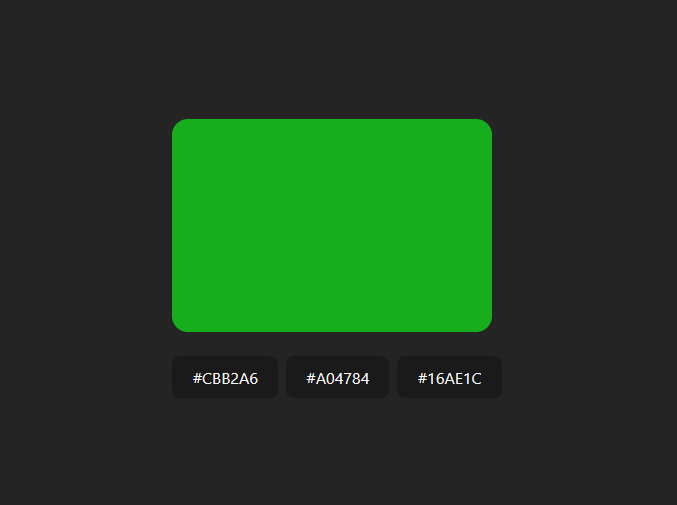

# My Awesome Project

This is a simple application where the user can guess the the color code for the displayed color.

**Link to project:** https://colourguesser.netlify.app/

## How It's Made:

**Tech used:** React, Vite

The application generates a random color at the first render using useEffect hook and also generates a list of options and stores them in state. If the user selects the correct option the application will generate a new random color after a set time, otherwise it will stay on the same page.

<!-- ## Optimizations

_(optional)_

You don't have to include this section but interviewers _love_ that you can not only deliver a final product that looks great but also functions efficiently. Did you write something then refactor it later and the result was 5x faster than the original implementation? Did you cache your assets? Things that you write in this section are **GREAT** to bring up in interviews and you can use this section as reference when studying for technical interviews! -->

## Lessons Learned:

This app helps to understand how useEffect hook works, when to use the hook and the importance of cleanup function in th useEffect hook, how dependency array will affect how the hook is executed.

## Examples:

Take a look at these couple examples that I have in my own portfolio:

**Frontend Mentor:** https://www.frontendmentor.io/profile/root9259

<!-- **Twitter Battle:** https://github.com/alecortega/twitter-battle

**Patch Panel:** https://github.com/alecortega/patch-panel -->
